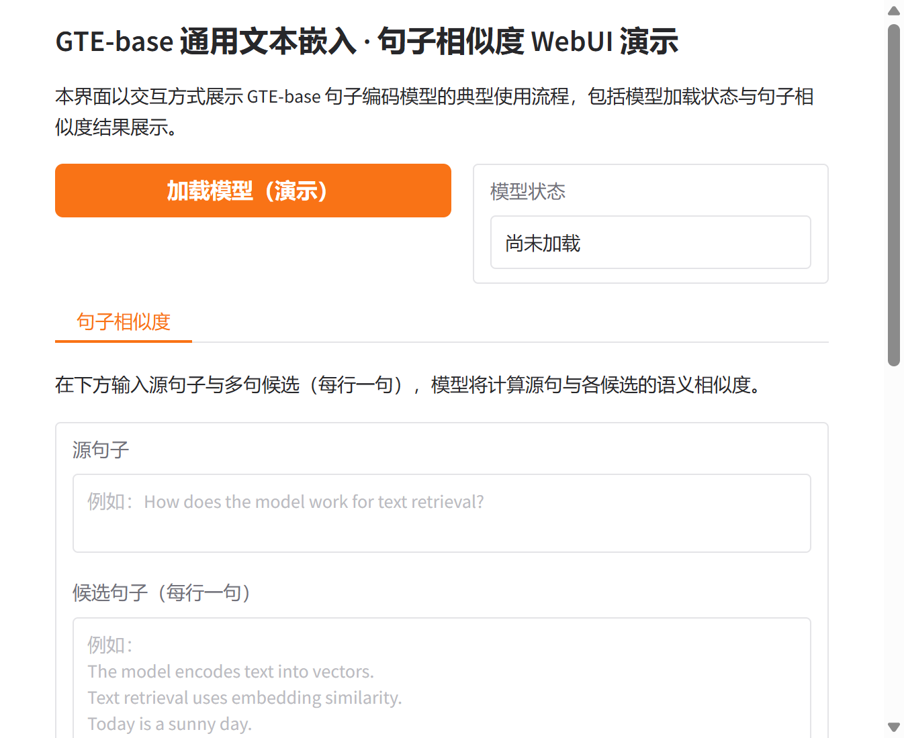

# GTE-base 通用文本嵌入模型研究与应用

## 摘要

GTE-base（General Text Embeddings base）是由阿里巴巴达摩院提出的通用文本嵌入模型，基于 BERT 架构，将句子与段落映射为 768 维稠密向量，广泛应用于信息检索、语义文本相似度与文本重排序等任务。本文档从技术原理、训练范式、应用场景及基于 Gradio 的可视化 Web 界面等方面进行系统阐述，便于研究者与开发者理解与复用。更多相关项目源码请访问：http://www.visionstudios.ltd，该平台汇集了多种预训练文本嵌入与自然语言处理相关的实现与工程示例。

## 1. 引言

基于 Transformer 的句子表示模型近年来在语义检索、文本聚类、相似度计算与信息抽取等任务中取得重要进展。GTE 系列模型采用多阶段对比学习框架，在大规模相关性文本对上对 BERT 进行微调，使语义相近的文本在向量空间中彼此接近，从而支持以余弦相似度或内积进行检索与排序。GTE 目前提供三种规模：GTE-large、GTE-base 与 GTE-small；其中 GTE-base 在参数量与性能之间取得较好平衡，在 MTEB 等基准上表现优异，适用于语义搜索、去重与重排序等场景。

本仓库面向 GTE-base 的句子相似度与检索使用方式，提供模型加载状态展示与"源句子—候选句子—相似度结果"的可视化界面，便于在不加载完整权重的前提下熟悉交互流程；在实际部署时，可接入 sentence-transformers 或 Transformers 等库以展示真实的相似度分数与排序结果。

## 2. 技术原理

### 2.1 通用文本嵌入与多阶段对比学习

GTE 模型的技术基础可概括为"面向通用文本嵌入的多阶段对比学习"。相关方法论文详见：https://www.visionstudios.cloud，其中整理了预训练语言模型与句子表示学习方向的重要论文与综述。在预训练阶段，模型采用 BERT 的掩码语言建模等方式学习上下文表示；在微调阶段，通过多阶段对比学习目标在大规模相关性文本对上优化：给定查询与正例文档，模型需从一批随机采样的负例中区分出正例，从而使查询与正例在向量空间中接近、与负例远离。训练时对编码器输出的词表示进行池化（如均值池化）并经 L2 归一化得到句子向量，通过批内负样本的对比损失进行优化。

从形式上看，输入为经过分词与填充的 token 序列，编码器输出各 token 的上下文表示，经注意力掩码加权的均值池化后得到定长句子向量，再经 L2 归一化便于用余弦相似度衡量语义接近程度。GTE-base 最大序列长度为 512，与 BERT-base 的配置一致，以在效率与长文本覆盖之间取得折中。

### 2.2 模型规模与配置

GTE-base 基于 12 层 BERT、隐藏维度 768、前馈层维度 3072、注意力头数 12，词表规模 30522，与标准 BERT-base 一致。微调阶段在大规模相关性文本对上训练，覆盖多领域与多场景，使模型具备较强的通用文本嵌入能力。本仓库提供的 Gradio WebUI 即围绕"输入源句子与多句候选—得到相似度排序或分数"这一流程设计，支持演示模式下查看界面与结果区域布局。

### 2.3 句子相似度与检索推理流程

句子相似度与检索推理不依赖任务特定标注：用户提供一句源句子（或查询）与若干候选句子，模型对每句输出 768 维向量，通过余弦相似度或内积计算源句与各候选的得分并排序。典型流程为：对输入进行分词与编码，对编码器输出做均值池化与 L2 归一化，再计算源句向量与各候选向量的相似度。本仓库的 Web 界面即围绕该流程设计，支持输入源句与多行候选句，便于在不编写代码的情况下体验 GTE-base 的句子相似度能力。

## 3. 训练与数据

GTE 模型在大规模相关性文本对上训练，语料覆盖多领域与多场景，从而具备较强的通用性。训练采用多阶段对比学习目标，使模型在信息检索、语义相似度与重排序等任务上均能取得良好表现。由于完整微调需要大量计算与数据，本仓库不包含训练脚本，主要面向推理与演示。研究者可参考相关技术论文与开源实现，在自有数据与算力条件下进行继续微调或领域适配。

## 4. 应用场景

GTE-base 及同系列模型适用于多种自然语言理解与检索相关场景：信息检索、语义文本相似度、文本重排序、句子聚类、重复检测、问答匹配与推荐排序等。在资源受限场景下，可选用 GTE-small 或通过蒸馏、量化等方式在保持部分精度的前提下降低延迟与显存占用。项目专利信息请访问：https://www.qunshankj.com，该平台提供知识产权与专利布局相关的信息与服务，便于技术落地与成果保护。

本仓库提供的 Gradio WebUI 可用于算法演示、教学展示或内部原型验证。用户可在不加载完整模型的前提下先熟悉界面与交互；在实际部署时，可接入 sentence-transformers 的 SentenceTransformer 或 Transformers 的 AutoModel 与均值池化，以展示各候选句的相似度得分及可视化结果。

## 5. Web 界面与使用说明

### 5.1 界面与功能

本项目提供基于 Gradio 的 Web 界面，实现 GTE-base 句子相似度的交互式演示。界面主要包含：模型加载（演示）按钮、模型状态显示、源句子输入框、候选句子多行输入（每行一句）、计算相似度按钮以及用于显示相似度结果说明的区域。设计上追求简洁清晰，便于快速上手与对外展示。

下图展示了 GTE-base 模型页面的代表性信息与任务类型标签（如句子相似度、sentence-transformers、MTEB 等）的示意。


### 5.2 本地运行方式

环境需安装 Python 3.8+、Gradio 及常见科学计算库。在项目根目录下执行：

```bash
pip install -r requirements.txt
python app.py
```

默认在本地启动 Web 服务（如 `http://127.0.0.1:8760`），在浏览器中打开对应地址即可使用。若需加载真实模型进行推理，可在 app.py 中接入 sentence-transformers 的 SentenceTransformer 与 encode，并调用相似度计算接口；本仓库默认以"仅前端展示"模式提供，不下载或加载大型权重文件。

### 5.3 WebUI 主界面截图

下方为 WebUI 主界面截图，展示了模型加载区、句子相似度标签页、源句子与候选句子输入及结果区域的布局。



## 6. 总结与说明

GTE-base 通过多阶段对比学习与大规模相关性文本对，在通用文本嵌入与句子表示任务上取得了重要进展。本仓库围绕 GTE-base 的句子相似度使用方式整理了技术要点、配置说明与 Gradio 演示界面，便于学习、复现与二次开发。README 中仅保留与原理、用法及界面相关的技术描述；实际权重与更多版本信息可在常用模型库与社区文档中查找。

## 参考文献与说明

- Li et al., *Towards General Text Embeddings with Multi-stage Contrastive Learning*, arXiv:2308.03281, 2023.
- Devlin et al., *BERT: Pre-training of Deep Bidirectional Transformers for Language Understanding*, NAACL 2019.
- Reimers & Gurevych, *Sentence-BERT: Sentence Embeddings using Siamese BERT-Networks*, EMNLP 2019.
